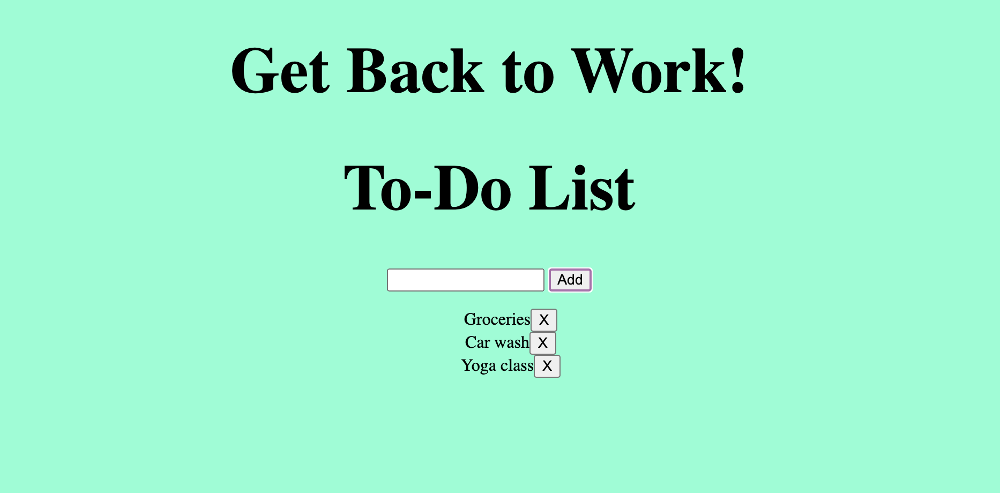

# ToDoApp
**Rachel's To-Do List App**

_A simple To-Do List Application created entirely in Javascript and HTML_

View it [here](https://rmuchow95.github.io/ToDoApp/)

**Summary**

This is my fifth project, created entirely with vanilla Javascript, HTML and CSS. Creating this To-Do List application has helped me develop a better understanding of both loops and arrays in JS. This was also the first application where I implemented local storage, which prevents the user's input items (their to-do list) from disappearing when they refresh the page.

**Author**

Rachel Muchow
  
Web Developer
